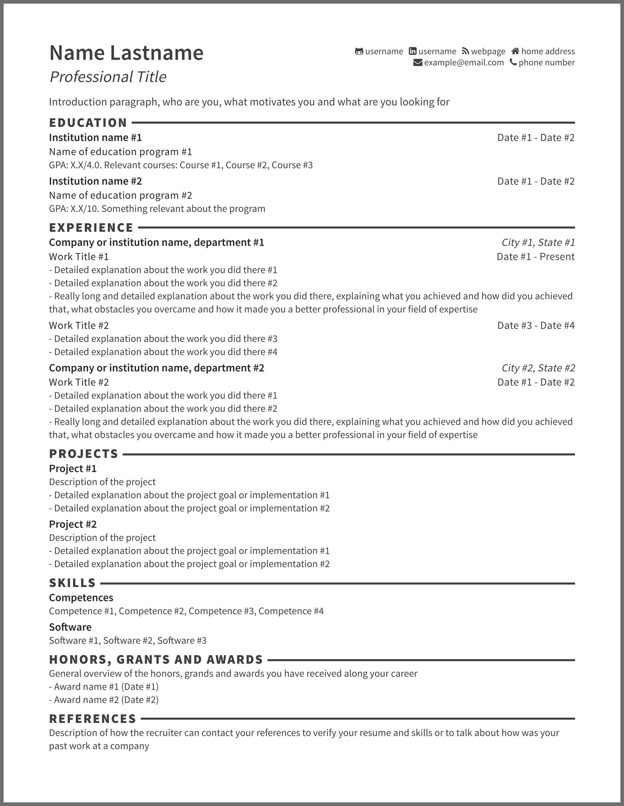

# Resume-YAML

Elegant one page resume, generated from a [YAML](http://www.yaml.org/) data file using [mustache](https://mustache.github.io/).
Outputs to plain text, Markdown and HTML.
Focused on readability and simplicity.

Example
----

See the [output folder](output/) for all output formats.

Prequisites
----
Install any [mustache](https://mustache.github.io/) implementation and add the mustache binary to your library path.

Run
----
Make sure your data file is named `resume.yaml`, in the output folder (use `example.yaml` as a starting point).
Generate the resume by executing `make resume`.
To save your resume in PDF format, open the generated HTML in Firefox, print it as PS (Postcript), and then transform it to PDF using ```ps2pdf``` or a similar utility.

License
----
[MIT](LICENSE) - Feel free to use and edit.

Tech
----
resume-yaml uses a number of open source projects to work properly:

* [mustache](https://mustache.github.io/) - logic-less templates
* [Font Awesome](https://fortawesome.github.io/Font-Awesome/) - font toolkit
